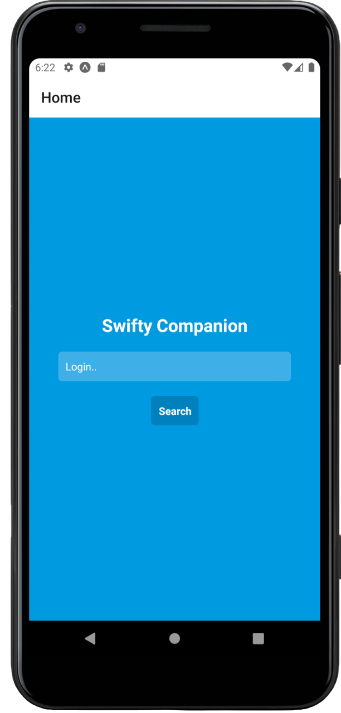
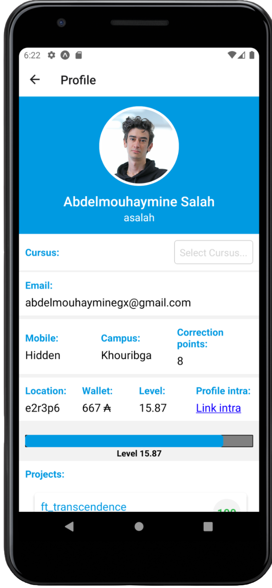
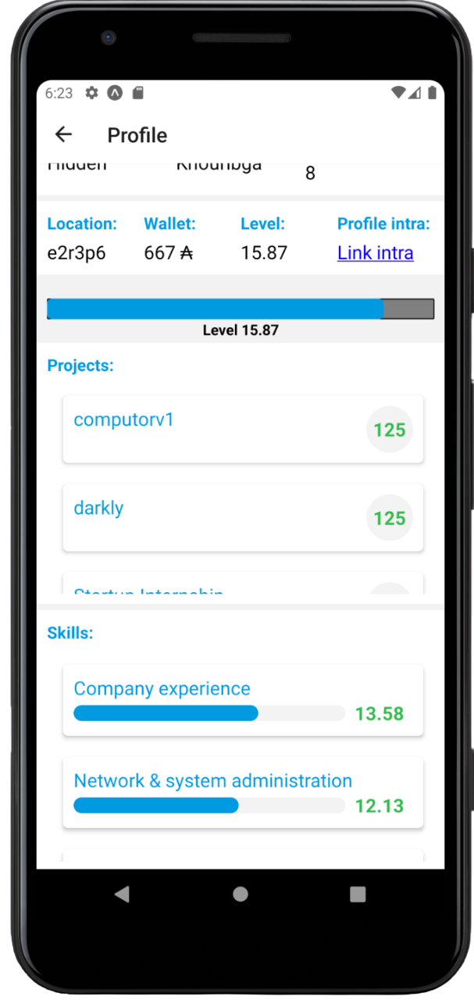
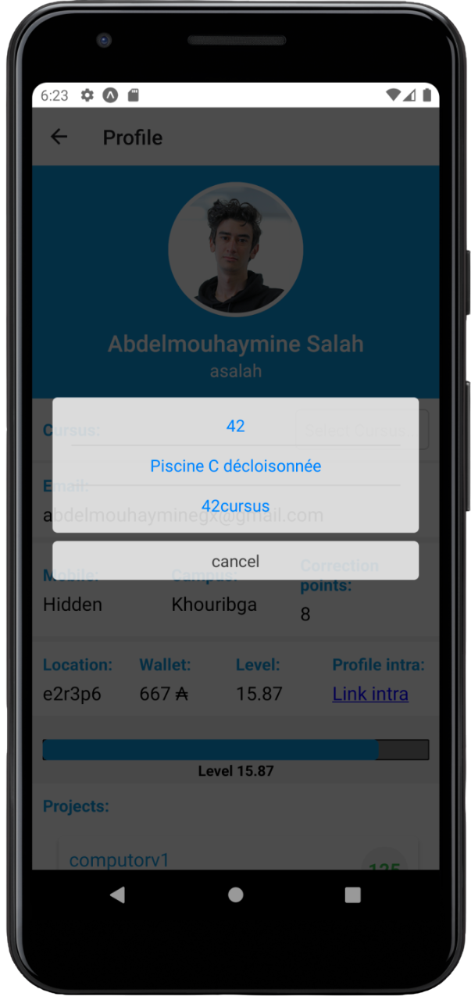

# Swifty Companion

A React Native mobile application for viewing 42 School student profiles. Search for any student by their login and explore their academic journey, projects, and skills across different cursus.

## Features

- **Student Search**: Search for any 42 student by their login
- **Profile Overview**: View comprehensive student information including:
  - Personal details (name, email, campus, location)
  - Academic stats (level, correction points, wallet)
  - Profile picture and intra profile link
- **Multi-Cursus Support**: Switch between different cursus to view specific progress
- **Projects Tracking**: Browse completed projects with grades and status
- **Skills Visualization**: Interactive skill bars showing proficiency levels
- **Real-time Data**: Fetches live data from 42's API

## Screenshots

| Home Screen | Profile Overview | Projects View | Switch cursus |
|-------------|------------------|---------------|-------------|
|  |  |  |  |

## Tech Stack

- **React Native** - Cross-platform mobile development
- **Expo** - Development platform and build tools
- **React Navigation** - Navigation between screens
- **Axios** - HTTP client for API requests
- **AsyncStorage** - Local data persistence
- **42 API** - Official 42 School API integration

## Prerequisites

- Node.js (v14 or higher)
- npm or yarn
- Expo CLI
- 42 API credentials

## Installation

1. Clone the repository:
```bash
git clone <repository-url>
cd Swifty-Companion
```

2. Install dependencies:
```bash
npm install
```

3. Set up environment variables:
```bash
cp .env.example .env
```
Edit `.env` and add your 42 API credentials:
```
API_UID=your_api_uid
API_SECRET=your_api_secret
```

## Usage

1. **Launch the app** and you'll see the search screen
2. **Enter a student login** (e.g., "asalah") 
3. **Tap Search** to fetch their profile
4. **Browse their information**:
   - Scroll through personal details
   - Use the cursus picker to switch between different programs
   - View completed projects and their grades
   - Check skill progression with visual bars
5. **Tap "Link intra"** to open their profile in the browser

## API Integration

The app integrates with the 42 School API to fetch real-time student data. It handles:
- OAuth2 token management with automatic refresh
- Rate limiting and error handling
- Secure credential storage

## Project Structure

```
├── components/          # Reusable UI components
│   ├── CursusPicker.jsx    # Cursus selection dropdown
│   ├── PercentageBar.jsx   # Level progress visualization
│   ├── Project.jsx         # Individual project display
│   └── Skill.jsx           # Individual skill display
├── screen/              # Main application screens
│   ├── Home.jsx            # Search/landing screen
│   └── Profile.jsx         # Student profile display
├── utils/               # Utility functions
│   └── api.js              # API integration logic
├── assets/              # Images and icons
└── App.js               # Main application component
```
